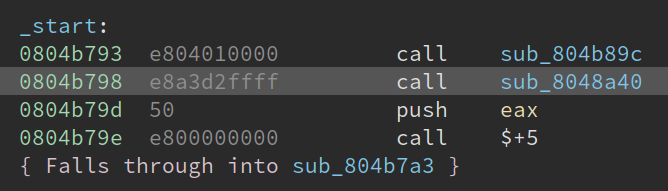
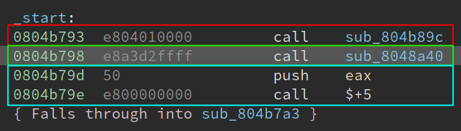
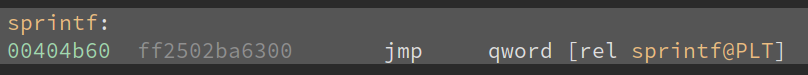

# How Remill reads code: the control-flow graph format

This document describes one of the main inputs to Remill, a control-flow graph
formatted and stored as a protocol buffer. The file format is described in the
[CFG.proto](/remill/CFG/CFG.proto) file.

## Instructions

Instructions are encoded with the `Instr` message type:

```protobuf
message Instr {
    required    bytes       bytes = 1;
    required    uint64      address = 2;
}
```

The two fields of this message are:
 - `bytes`: The raw bytes of the instruction
 - `address`: The address of the instruction within the executable or object file



In the above example from Binary Ninja, an `Instr` data structure for the `call sub_8048a40` would have:
 - `bytes` as `"\xe8\xa3\xd2\xff\xff"`
 - `address` as `0804b798`

In practice, the `address` field is really just an offset from the beginning of a binary. The location at which binaries can be loaded varies according to the OS, as well as the current execution of the binary. For example, a shared library is likely to be loaded at different runtime memory addresses during different program executions when [ASLR](https://en.wikipedia.org/wiki/Address_space_layout_randomization) is enabled.

## Basic blocks

Basic blocks of code an encoded with the `Block` message type:

```protobuf
message Block {
    required    uint64      address = 1;
    required    bool        is_addressable = 2;
    repeated    Instr       instructions = 3;
}
```

Basic blocks in the CFG format are not equivalent to basic blocks as presented in the IDA or Binary Ninja GUIs. Notice that the basic block in the above image has four instructions. In Remill, this assembly listing correspond to the three highlighted basic blocks:



In Remill, all basic blocks end at control-flow instructions, or at fall-through instructions. The following general rules apply:

 - The ends of blocks in IDA or Binary Ninja are also the ends of `Block`s in Remill
 - Blocks in IDA or Binary Ninja containing `call` instructions must be split into distinct `Block`s in remill, each "sub" block ending at the `call` instruction. Other split points (on x86) are `syscall`, `sysret`, `sysenter`, `sysexit`, `int`, `int3`, `into`, `bound`, and `cpuid`.

The `address`es of the individual `Block`s are  `0804b793` (red), `0804b798` (green), and `0804b79d` (blue), respectively.

The `is_addressable` field in the `Block` message is more subtle and exposes a detail about how control-flow in Remill is represented. Remill is a block-based binary translator. Whereas [McSema](https://github.com/trailofbits/mcsema) translates whole functions at a time, Remill only translates one block at a time.

Each `Block` message in the CFG protocol buffer is represented by a distinct LLVM function in the lifted bitcode. Control-flow between basic blocks in the machine code is represented as function [tail calls](https://en.wikipedia.org/wiki/Tail_call) between between lifted block functions. This raises the following question: how are "indirect" control-flows (`ret`, `jmp reg`, `jmp mem`, `call reg`, and `call mem`) represented in the LLVM bitcode?

The transfer of control for indirect control-flows are modelled using the following Remill [intrinsics](INTRINSICS.md). These instrinsics do not encode the mechanics of the control flows, however. For example, a function call instruction on x86 (`call`) modifies the stack and then jumps to the target. The [semantics functions](/remill/Arch/X86/Semantics/CALL_RET.cpp) are responsible for performing the stack manipulations of the call and modifying the instruction pointer. The intrinsics are responsible for the actual "transfer" of control to another lifted basic block.

 - `jmp reg/mem` is represented as a tail-call to `__remill_jump`
 - `call reg/mem` is represented as a tail-call to `__remill_function_call`
 - `ret` is represented as a tail-call to `__remill_function_return`

Getting back to the `is_addressable` field. The idea here is that any basic block that *could* be targeted by an indirect control-flow should have its corresponding `Block` marked as `is_addressible`. To that end, the block following a `call` instruction is addressable because it is likely to be the target of a `ret` instruction. The block beginning an exported function is addressable because it is exposed to the outside world. The entry blocks associated with function pointers stored in [vtables](https://en.wikipedia.org/wiki/Virtual_method_table) in the `.data` section are addressable because they are likely to be the targets of indirect `call`s.

Finally, the `instructions` list is as you would expect: a list of `Instr` messages, each corresponding to a machine code instruction within the block.

## Named blocks

Named basic blocks are used to represent imported and exported functions. For example, an executable that imports libc and calls `printf` would have a named block, whose address would be the address of `sprintf`. The following message type is used to represent a named block:

```protobuf
enum Visibility {
    EXPORTED    = 0;
    IMPORTED    = 1;
}

message NamedBlock {
    required    string      name = 1;
    required    uint64      address = 2;
    required    Visibility  visibility = 3;
}
```

Following along with the `sprintf` example, the `NamedBlock` associated with the entry point to `sprintf` would be `"sprintf"`. The `address` field is a bit more subtle than what was described above.

If `sprintf` is an imported function, then how can we know its address? In practice (at least in ELF binaries), there is a [thunk](https://en.wikipedia.org/wiki/Thunk) used to represent the address of `sprintf`. For example, below is the thunk for sprintf:



```assembly
sprintf@plt:
   0x0000000000404b60 <+0>:   jmp    QWORD PTR [rip+0x63ba02]        # 0xa40568
   0x0000000000404b66 <+6>:   push   0xc
   0x0000000000404b6b <+11>:  jmp    0x404a90
```

So, in the `NamedBlock` message, the `address` of `sprintf` will be `0404b60`.

The `sprintf` function is imported, and so we will assign its `visibility` to be `IMPORTED`. Importantly, we don't want to have a `Block` that conflicts with an imported `NamedBlock`. That is, the CFG file *must not* contain a `Block` with the same address as a `NamedBlock` that is `IMPORTED`.

If we were lifting a shared library, and our shared library exported the function `foo`, then the `visibility` of `foo` would be `EXPORTED`. In this case, there *must be* a `Block` whose `address` matches that in the `NamedBlock`.

## Module

The `Module` message ties everything together. It includes all `Block`s and `NamedBlock`s:

```protobuf
message Module {
    repeated    Block       blocks = 1;
    repeated    NamedBlock  named_blocks = 2;
    repeated    uint64      referenced_blocks = 3;
}
```

It also includes `referenced_blocks`. The `Module` message is not required to, but can, contain all code within a binary. In fact, one can produce one `Module` message per function/subroutine found within the binary.

The `referenced_blocks` must be populated in the case where a `Module` does not include all blocks within the binary. For example, suppose our `Module` did not contain the code associated with `sub_804b89c` and `sub_8048a40`. In this case, the addresses `0804b89c` and `08048a40` must be added to the `referenced_blocks` list.
